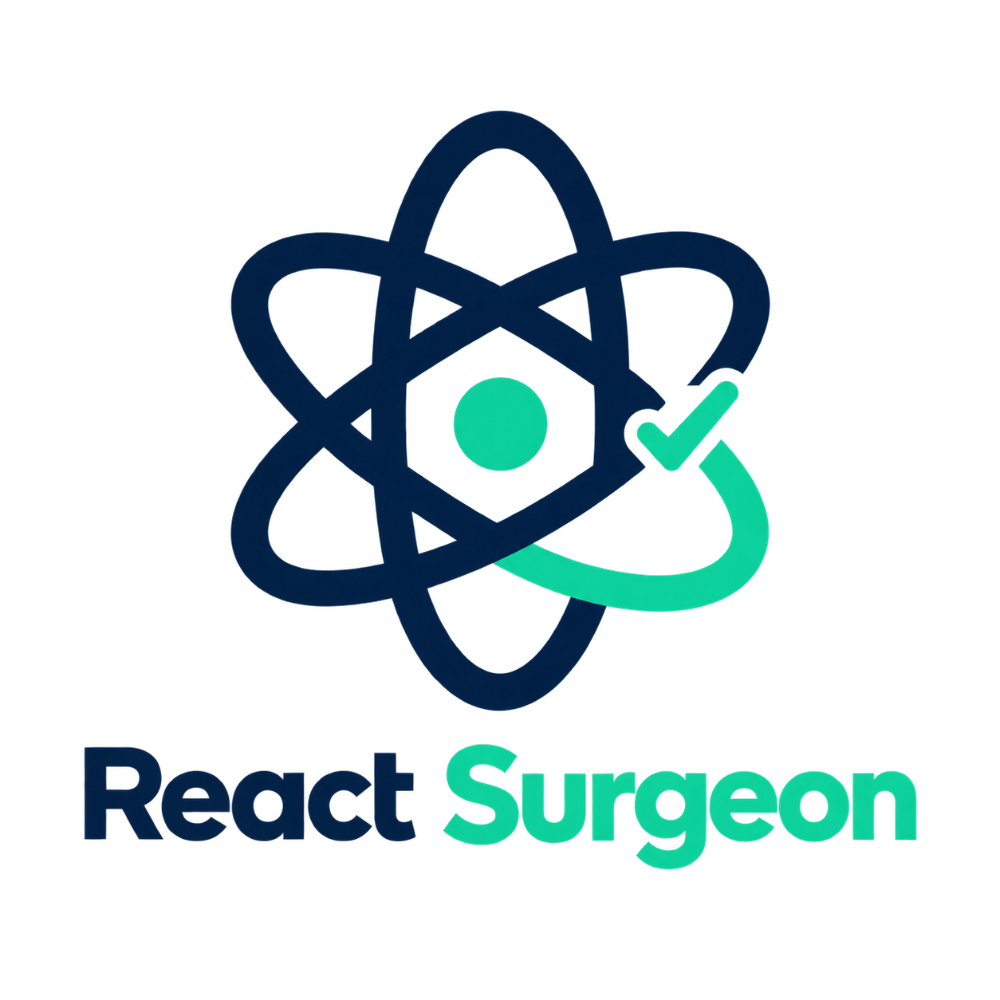
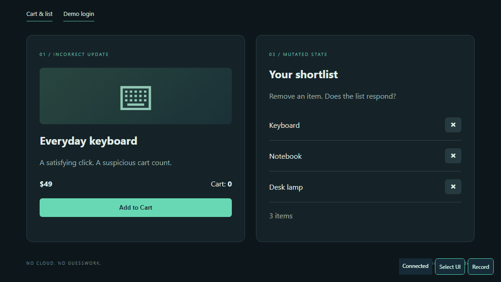
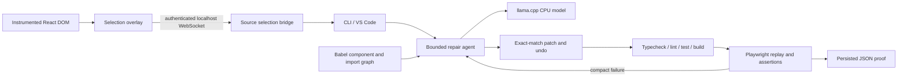

<p align="center">
  
</p>

<h1 align="center">React Surgeon</h1>

<p align="center"><strong>Click a bug. Watch it get diagnosed, fixed, and verified.</strong></p>

<p align="center">
  A local, React-specific repair agent. No cloud, no API keys, no telemetry.
</p>

<p align="center">
  <a href="https://github.com/waleedmustafa971/React-surgeon/actions/workflows/ci.yml"></a>
  
  
  
</p>

---

React Surgeon closes the loop between _seeing_ a bug in your running React app and _proving_ it is gone.

A development-only Vite plugin maps clicked DOM elements back to the JSX that rendered them. Deterministic Babel analysis narrows the surrounding code to a small, relevant context for a local Qwen Coder model. A bounded agent proposes exact, minimal edits. Static checks and a Playwright acceptance scenario — not the model's own opinion — decide whether the change is **VERIFIED**.

Everything runs on your machine, on CPU.

<p align="center">
  
</p>

<p align="center"><em>One click adds two. Selecting the button reports the exact JSX that rendered it — <code>src/components/ProductCard.tsx:19</code> — without firing the app's own handler.</em></p>

## Contents

- [How it works](#how-it-works)
- [Requirements](#requirements)
- [Install](#install)
- [Quick start](#quick-start)
- [The demo bugs](#the-demo-bugs)
- [CLI reference](#cli-reference)
- [Acceptance scenarios](#acceptance-scenarios)
- [Verification, proof, and undo](#verification-proof-and-undo)
- [The repair agent](#the-repair-agent)
- [Configuration](#configuration)
- [The model](#the-model)
- [VS Code extension](#vs-code-extension)
- [Use with your own React project](#use-with-your-own-react-project)
- [Architecture](#architecture)
- [Security boundaries](#security-boundaries)
- [Development](#development)
- [Limitations and troubleshooting](#limitations-and-troubleshooting)

## How it works



1. **Locate.** The Vite plugin stamps source coordinates onto intrinsic JSX elements during `serve` only. The overlay highlights what you hover and reports the file, line, role and accessible name of what you click.
2. **Understand.** Babel builds a component, hook, route and import graph. The agent assembles context from the clicked element, its imports, related components, and words in your task description — not the whole repository.
3. **Reproduce.** The agent runs your acceptance scenario against the _unmodified_ app first. If it already passes, the task is refused rather than inventing a change.
4. **Repair.** The local model returns one structured action at a time: a read-only inspection tool, or an exact-match replacement of a unique existing substring.
5. **Verify.** Inference stops, freeing memory. Typecheck, lint, tests and a production build run, then the same scenario is replayed in a fresh Chromium context.
6. **Prove.** A JSON proof records the original failure, the exact diff, every check result, and every assertion. `VERIFIED` is only returned when all of it passes.

## Requirements

- **Node.js 22.12+** and npm.
- A **React project** — Vite-based for element selection.
- Linux, macOS or Windows on x64/arm64. CI covers all three.

**Nothing else.** The llama.cpp runtime arrives as a prebuilt binary through npm, so there is no system install, no CUDA, no Docker, no Python, no API keys, no cloud service, no telemetry, and no subscription. Inference is CPU-only and stays on your machine. Designed to fit **6 GB RAM** by unloading the model before static checks and browser launch; running other heavy applications may still cause paging.

## Install

```bash
npm install -g @react-surgeon/cli
cd your-react-app
npm install -D @react-surgeon/vite-plugin
react-surgeon init
```

`init` does the whole setup in one command: detects your React project, writes `.react-surgeon/config.json`, adds `surgeon()` to your Vite config ahead of the React plugin, installs Chromium, then downloads and smoke-tests the model. It is idempotent, so re-run it after fixing anything it flags. Use `--skip-browser` or `--skip-model` to defer the slow parts.

The Vite plugin is what maps a clicked element back to its JSX, so it belongs to the app being repaired rather than the CLI.

<details>
<summary>Minimal install, if you already run Ollama or LM Studio</summary>

The bundled runtime is an `optionalDependency`, so it can be skipped:

```bash
npm install -g @react-surgeon/cli --omit=optional
```

That takes the dependency tree from 120 packages to 24, with **no install scripts at all**, leaving only Babel, `playwright-core`, `commander`, `diff`, `ws` and `zod`. Everything `node-llama-cpp` brings with it, including its native binaries and its postinstall, is gone.

Then set `model.provider` to `openai-compatible` and point it at a server you already run. `doctor` will report `bundledRuntime: Missing`, which is expected on this path.

Worth knowing if you audit dependencies: the default install needs filesystem access to edit your source, shell access to run your npm scripts, and network access to download the model and Chromium. Those are inherent to what the tool does rather than incidental.

</details> The first model download is roughly 1 GB and takes a few minutes. `react-surgeon doctor` reports OS, RAM, CPU, Node, which provider is configured and where inference will happen.

<details>
<summary>Working from a clone of this repository instead</summary>

```bash
npm install
npm run build
npm run surgeon -- init
```

Then use `npm run surgeon -- COMMAND` wherever the docs say `react-surgeon COMMAND`.

</details>

## Quick start

Three terminals. First, start the demo app:

```powershell
npm run demo
```

Second, start the selection bridge:

```powershell
npm run surgeon -- --project examples/buggy-react-app start
```

Open the URL it prints — it carries a one-time session capability that authenticates the localhost bridge. Click **Select UI**, then hover and click **Add to Cart**. Selection suppresses the app's own click handler and reports the source file and line. The model stays asleep until it is needed.

Third, repair and prove:

```powershell
npm run surgeon -- --project examples/buggy-react-app fix "Each Add to Cart click should add exactly one item" --scenario scenarios/cart.json
npm run surgeon -- --project examples/buggy-react-app proof
```

A successful run looks like this:

```
Reproducing the original behavior…
Tracing src/components/ProductCard.tsx:19 from browser reproduction
Diagnosing (step 1/12, patch cycle 1/4)…
Patching src/components/ProductCard.tsx…
Checking typecheck… lint… test… build…
Replaying browser scenario…
VERIFIED — static checks and browser assertions passed
```

```diff
   function handleAdd() {
-    setCount(count + 2);
+    setCount(count + 1);
   }
```

## The demo bugs

`examples/buggy-react-app` ships three reproducible defects, each with a matching scenario.

| Bug              | Select          | Expected behaviour                                                            | Scenario               |
| ---------------- | --------------- | ----------------------------------------------------------------------------- | ---------------------- |
| Incorrect update | Add to Cart     | One item per click; the initial code adds two                                 | `scenarios/cart.json`  |
| Login redirect   | Sign in         | Navigates to `/dashboard`; the initial code navigates to `/login`             | `scenarios/login.json` |
| Mutated state    | Remove Keyboard | The list immediately shows two items; the initial code mutates the same array | `scenarios/list.json`  |

Restore all three to their documented starting state at any time:

```powershell
npm run reset:demo
```

This overwrites only those three component files from stored fixtures — do not run it if you have manual edits there. Refresh the browser afterwards to clear local state. `npm run check:demo` verifies the demo is in its documented buggy state and is enforced by a pre-commit hook, so agent edits are never committed into the lab.

## CLI reference

Run `react-surgeon [--project PATH] COMMAND`, or `npm run surgeon -- COMMAND` from a clone of this repository.

| Command                           | Purpose                                                                          |
| --------------------------------- | -------------------------------------------------------------------------------- |
| `init`                            | Set up this project: config, Vite plugin, Chromium, model                        |
| `doctor`                          | OS, RAM, CPU, Node, provider, and where inference will happen                    |
| `model setup`                     | Download/cache, start, inference test, stop                                      |
| `model start`                     | Keep the owned model running in the foreground                                   |
| `model stop`                      | Stop the owned foreground model through its authenticated local control endpoint |
| `scan`                            | React libraries, scripts and entry points                                        |
| `xray`                            | Components, hooks and relationships as a text graph                              |
| `health`                          | Deterministic diagnostic hints (for example, direct state mutation)              |
| `start`                           | Model smoke test plus the selection and recording bridge                         |
| `scenario new`                    | Draft an acceptance scenario from the last recorded reproduction                 |
| `diagnose "task"`                 | Read-only local model diagnosis; never patches                                   |
| `fix "task" --scenario file.json` | Reproduce, patch, check, replay, save proof                                      |
| `verify --scenario file.json`     | Verify the current project state without patching                                |
| `proof`                           | Print the last persisted proof                                                   |
| `undo`                            | Restore the original files from the last patch session                           |

Global options: `--project <path>` selects the React project root (defaults to the current directory), `--verbose` enables detailed lifecycle logs.

`init` takes `--skip-browser` and `--skip-model`. `scenario new` takes `--out <file>` (default `scenarios/draft.json`) and `--name <name>`.

`fix` and `verify` exit with code `1` when the result is not `VERIFIED`, so they compose in scripts.

## Acceptance scenarios

A scenario is a JSON file with `name`, `baseURL`, and 1–200 `steps`. It is the acceptance contract: you write it, and it decides the outcome.

```json
{
  "name": "One click adds exactly one item",
  "baseURL": "http://127.0.0.1:5173",
  "steps": [
    { "action": "navigate", "url": "/" },
    { "action": "assertText", "testId": "cart-count", "value": "0" },
    { "action": "click", "role": "button", "name": "Add to Cart" },
    { "action": "assertText", "testId": "cart-count", "value": "1" },
    { "action": "click", "role": "button", "name": "Add to Cart" },
    { "action": "assertText", "testId": "cart-count", "value": "2" }
  ]
}
```

| Action          | Fields                                   | Notes                                 |
| --------------- | ---------------------------------------- | ------------------------------------- |
| `navigate`      | `url`                                    | Relative to `baseURL`; localhost only |
| `reload`        | —                                        | Reloads the current page              |
| `click`         | `role` + `name`, `testId`, or `selector` |                                       |
| `fill`          | target + `value`                         | `value` is capped at 2000 characters  |
| `submit`        | target                                   | Submits the owning form               |
| `assertText`    | target + `value`                         | **Exact** match, not a substring      |
| `assertVisible` | target                                   |                                       |
| `assertURL`     | `value`                                  |                                       |

Prefer accessible roles and names, or `data-testid`, over CSS selectors — they survive refactors. Browser navigation and network requests are restricted to localhost.

**Recording a scenario.** While `start` is running, the overlay recorder captures clicks, changed inputs, form submissions and back/forward navigation into `.react-surgeon/recording.json`. Password fields are recorded as `[REDACTED]` and cannot be replayed without a locally supplied demo value.

**Drafting one from the recording.** Writing the scenario is the part that actually costs time — finding stable targets and deciding what to assert. `scenario new` does the mechanical half:

```bash
react-surgeon scenario new --out scenarios/cart.json --name "One click adds exactly one item"
```

It replays your recording in a real browser, watches which `data-testid` values and which URL change, and writes a scenario that asserts the starting values, performs your recorded interactions, and asserts the ending values:

```
Observed during the reproduction:
  cart-count: 0 -> 4
```

The catch, and it is deliberate: those ending values are **what the app currently does, which is the bug**. The draft is labelled accordingly and carries a `_draft` block listing exactly what to change. Edit `4` to the `2` you actually expect, delete the block, and run `fix`. The tool finds the targets; you still decide what correct means — which is the same reason it refuses to invent acceptance criteria anywhere else.

If nothing changed during the reproduction, it says so: add `data-testid` to the values that should change and re-record.

## Verification, proof, and undo

The agent runs your scenario against the original app **first**. If it already passes, the task is **blocked** rather than fabricating a reproduction.

After editing, it runs the available `typecheck`, `lint`, `test` and `build` scripts — missing optional scripts are skipped — and then replays the scenario.

**`VERIFIED` requires all of:**

- a successful production build,
- no failed static checks,
- a passing browser replay with at least one assertion,
- no console errors, page errors, or failed requests.

Anything else is **`BLOCKED`**. This distinction is the whole point of the tool: a patch that typechecks, lints, tests and builds cleanly can still be wrong, and only the browser replay catches it.

> **Unverified edits stay on disk.** When a run ends `BLOCKED`, the last attempted patch is still in your working tree so you can inspect it. The CLI says so explicitly and prints the `undo` command. Nothing is committed, pushed or deployed on your behalf.

```powershell
npm run surgeon -- --project examples/buggy-react-app undo
```

`undo` restores the originals from the last patch session, preserving original line endings.

**Proof.** Every run writes `.react-surgeon/proofs/<timestamp>.json` and updates `latest.json`, containing the original failure, the task, the acceptance assertions, the exact patch diff, all check output, and the replay result. A proof is evidence about a _particular workspace state_ — later manual edits or an `undo` invalidate its applicability to the current files. Treat `.react-surgeon/` as private workspace data; it can contain source diffs and scenario input.

## The repair agent

1. Detect React from `package.json` and scan the source with Babel.
2. Run the acceptance scenario on the original app to capture a real failure.
3. Assemble source context from the UI location, imports, related components and task words.
4. Ask the local model for **one** action: a semantic read/search tool, a minimal exact replacement, or completion.
5. Validate the JSON strictly; allow one malformed-format retry.
6. Apply only a **unique exact match** in a `.js/.jsx/.ts/.tsx/.css` file, persisting the original first.
7. Stop inference, run the static checks, then replay the same scenario.
8. Persist proof. Return `VERIFIED` only if everything passes.
9. Otherwise narrow the context around a compact failure summary and try again.

**Budgets.** Up to **12 model steps** total (read-only tool calls included) and at most **4 patch-and-verify cycles**; each cycle runs the full static suite and a browser replay. Progress is reported as `Diagnosing (step N/12, patch cycle M/4)`. Repeating an identical action is blocked to prevent loops.

Failed edits never fall back to rewriting whole files. The model cannot execute arbitrary commands, choose a script outside the verifier's allowlist, create or delete files, or modify `package.json`. Its completion text is never treated as proof.

The 4096-token window reserves a modest generation allowance and uses a conservative character budget rather than a perfect tokenizer, so unusually token-dense source can still exhaust the context. No conversation history and no full repository snapshot are ever sent.

## Configuration

`.react-surgeon/config.json` is created with defaults on first run.

| Key                                                   | Default                                 | Purpose                                                                                                                                     |
| ----------------------------------------------------- | --------------------------------------- | ------------------------------------------------------------------------------------------------------------------------------------------- |
| `model.provider`                                      | `node-llama-cpp`                        | `node-llama-cpp` (bundled, nothing to install), `llama.cpp` (a `llama-server` on `PATH`), or `openai-compatible` (a server you already run) |
| `model.repository`                                    | `Qwen/Qwen2.5-Coder-1.5B-Instruct-GGUF` | Hugging Face repository                                                                                                                     |
| `model.quantization`                                  | `Q4_K_M`                                | Or `Q3_K_M` for tighter memory                                                                                                              |
| `model.contextSize`                                   | `4096`                                  | 2048–16384                                                                                                                                  |
| `model.threads`                                       | `4`                                     | CPU threads for inference                                                                                                                   |
| `model.modelPath`                                     | _(auto)_                                | Absolute path to a GGUF, to share one cache across projects                                                                                 |
| `model.executable`                                    | _(auto)_                                | `llama.cpp` only: path to `llama-server` if not on `PATH`                                                                                   |
| `model.port`                                          | `18081`                                 | `llama.cpp` only: local inference port                                                                                                      |
| `model.baseURL`                                       | `http://127.0.0.1:11434/v1`             | `openai-compatible` only: where the server listens                                                                                          |
| `model.model`                                         | `qwen2.5-coder:1.5b`                    | `openai-compatible` only: model name the server exposes                                                                                     |
| `model.apiKeyEnv`                                     | _(none)_                                | `openai-compatible` only: **name of the environment variable** holding a key, never the key itself                                          |
| `model.allowRemote`                                   | `false`                                 | `openai-compatible` only: permit a non-loopback endpoint                                                                                    |
| `memoryMode`                                          | `low`                                   | `low` unloads the model before verification                                                                                                 |
| `verification.lint` / `.test` / `.build` / `.browser` | `true`                                  | Disable a stage if your project lacks it                                                                                                    |
| `bridgePort`                                          | `18080`                                 | Selection bridge port                                                                                                                       |
| `appURL`                                              | `http://127.0.0.1:5173`                 | Where your dev server runs                                                                                                                  |

## The model

Three providers, all behind one `ModelProvider` interface. Default: `Qwen/Qwen2.5-Coder-1.5B-Instruct-GGUF:Q4_K_M`, 4096-token context, temperature 0.1, a single generation, four CPU threads, zero GPU layers.

**`node-llama-cpp` (default).** llama.cpp compiled into a prebuilt binary that npm installs for your platform — nothing to put on `PATH`. It runs in-process, and the agent disposes the context and weights before static checks and the browser replay, which is what keeps the pipeline inside 6 GB. If your platform has no prebuilt binary, install fails softly and `doctor` reports `bundledRuntime: Missing`.

**`llama.cpp`.** Drives a `llama-server` (or `llama serve`) found on `PATH`, as a separate process on `model.port`. Use it when you want your own build — a different quantization, GPU offload, or a patched llama.cpp. Install it with `winget install ggml.llamacpp` or from [the llama.cpp releases](https://github.com/ggml-org/llama.cpp/releases).

**`openai-compatible`.** Points at a server you already run — Ollama, LM Studio, llama-server, vLLM. React Surgeon does not own that process, so it never starts or stops it; `memoryMode: low` cannot unload someone else's server before the browser phase, so leave headroom yourself.

```json
{
  "model": {
    "provider": "openai-compatible",
    "baseURL": "http://127.0.0.1:11434/v1",
    "model": "qwen2.5-coder:1.5b"
  }
}
```

**The endpoint must be loopback.** A non-local `baseURL` is refused unless you explicitly set `model.allowRemote`, because sending your source code off the machine should be a decision, not a default. An API key is read from the environment variable named by `apiKeyEnv` and never stored in the config file.

Generation is constrained to JSON: the two llama.cpp providers enforce a grammar, and because an arbitrary OpenAI-compatible server may ignore `response_format` entirely, responses are also unwrapped from markdown fences and surrounding prose before parsing. Repository text is treated as untrusted data throughout.

## VS Code extension

```powershell
npm run package:vscode
code --install-extension dist/react-surgeon-0.2.0.vsix
code examples/buggy-react-app
```

Alternatively use **Extensions → … → Install from VSIX**. Start the demo in a terminal, open the React Surgeon Activity Bar, choose **Connect project**, then **Select UI element**. Enter a bug description, choose **Diagnose & Fix**, and select an acceptance scenario when prompted. The panel also exposes verification, proof and X-Ray.

Workspace trust is required to execute project scripts. The extension needs Node and npm on the host.

**The extension cannot use the bundled `node-llama-cpp` runtime.** That package is a platform-specific native binary, so embedding it would make each VSIX installable on exactly one operating system. Inside VS Code, set `model.provider` to `llama.cpp` (a `llama-server` on `PATH`) or `openai-compatible` (an Ollama or LM Studio you already run). The CLI has no such limitation.

## Use with your own React project

Install or link `@react-surgeon/vite-plugin` from this workspace, then add `surgeon()` **before** the React plugin:

```ts
import surgeon from "@react-surgeon/vite-plugin";
import react from "@vitejs/plugin-react";

export default defineConfig({
  plugins: [surgeon(), react()],
});
```

The plugin uses `apply: 'serve'`, instruments intrinsic JSX elements only, and leaves production output untouched.

Then configure `.react-surgeon/config.json` for your app URL and, if 5173/18080/18081 are occupied, alternative ports. Provide a Vite `dev` script for automatic dev-server launch; otherwise start the app yourself. An existing user-owned server on the configured URL is always reused, never replaced.

## Architecture

| Package                      | Role                                                            |
| ---------------------------- | --------------------------------------------------------------- |
| `@react-surgeon/shared`      | Shared types and schemas                                        |
| `@react-surgeon/core`        | Analysis, agent, model provider, patching, verification, bridge |
| `@react-surgeon/vite-plugin` | Dev-only JSX source instrumentation and selection overlay       |
| `@react-surgeon/cli`         | `react-surgeon` command line                                    |
| `packages/vscode`            | VS Code extension                                               |
| `examples/buggy-react-app`   | The demo lab — an ordinary React/Vite project                   |

There is exactly one agent and one inference process, with browser verification serialized _after_ inference shutdown.

The plugin runs before JSX compilation, and MagicString inserts source attributes into intrinsic JSX opening tags while preserving source maps. A shadow-root overlay highlights hovered nodes and intercepts the selection click. Metadata uses project-relative paths only. The bridge binds `127.0.0.1`, validates the origin and a random session capability, and validates every received source path.

Babel extracts components, props, hooks, state, events, routes and ordinary relative imports; names and resolved imports determine likely parent relationships. This is deliberately conservative — higher-order wrappers and dynamic imports need better analysis in a later version.

`ResourceManager` shuts the model down before launching verification. Vite is started only if the configured URL is unavailable. A single Chromium instance is created per replay and closed in a `finally`. Process execution captures bounded output with timeouts, and Ctrl+C shuts down owned services.

See [docs/ARCHITECTURE.md](docs/ARCHITECTURE.md) and [docs/AGENT.md](docs/AGENT.md).

## Security boundaries

Use React Surgeon only with **trusted local projects**. It is an MVP, not an operating-system sandbox. Full detail is in [docs/SECURITY.md](docs/SECURITY.md).

- **Filesystem.** Model-facing paths are canonicalized inside the selected workspace. Absolute paths, traversal, escaping symlinks and junctions, `.env` variants, SSH material, common credential paths, `node_modules` and build output are blocked. Search skips symlinks and hidden directories. Patching is restricted to React source and CSS.
- **Execution.** Only predetermined npm script categories run: `typecheck`, `lint`, `test`, `build`, and the Vite dev server. A package script can itself run arbitrary code, so an allowlisted _name_ does not make an untrusted repository safe. VS Code workspace trust is required.
- **Network.** The bridge and the model server both bind `127.0.0.1`. Neither opens a firewall port. Playwright navigations and requests are restricted to localhost in a fresh non-persistent context; personal browser profiles and password stores are never opened.
- **Secrets.** Session URLs contain a local capability — do not share them. The overlay strips it from the URL and keeps it in tab session storage. Context and command summaries redact common secret assignments and token patterns, but this is heuristic: **do not put production credentials in source or scenarios.**
- **Not exposed to the model.** Commits, pushes, deployments, cloud calls, arbitrary shell tools, dependency installation and file deletion.

Core inference stays local. npm packages, browser binaries and GGUF weights are downloaded from their distribution servers; once cached, coding and verification need no hosted AI service. There is no telemetry.

**Review every diff before committing or deploying.**

## Development

```powershell
npm run typecheck
npm run lint
npm test
npm run build
npm run check:demo
npm run test:vsix
npm run test:integration
npm run package:vscode
```

| Script                        | What it does                                                                                        |
| ----------------------------- | --------------------------------------------------------------------------------------------------- |
| `build`                       | Emits each workspace's dist entry with esbuild                                                      |
| `typecheck` / `lint` / `test` | The normal checks; unit tests use isolated temp folders and one Vitest worker to limit memory       |
| `check:demo`                  | Fails if the demo app is not in its documented buggy state                                          |
| `reset:demo`                  | Restores the three demo defects from fixtures                                                       |
| `test:vsix`                   | Extracts the VSIX and verifies isolated activation, commands, CSP and the packaged Chromium runtime |
| `test:integration`            | Full end-to-end run against the **real** Qwen model                                                 |
| `package:vscode`              | Bundles the extension with esbuild and packages it with `@vscode/vsce`                              |

`npm install` also installs the repository git hooks (`core.hooksPath` → `.githooks`). The pre-commit hook runs `check:demo` so an agent's working-tree edits can never be committed into the demo lab — that would break `npm run lint` on a fresh clone and turn the lab into a no-op.

The integration test is not a mock: it exercises hover, selection, source mapping, a model-generated patch, static checks, browser assertions and proof, then restores the demo defect to keep the lab repeatable. Evidence is copied to `dist/integration-proof.json`.

The demo app has its own `typecheck`, `lint`, `test` and `build` scripts, so the agent verifies the _target_ application rather than its own code.

Windows execution policies or managed sandboxes may block child processes, downloads or cache writes. Use the environment's explicit approval mechanism; do not bypass it.

External references: [Vite plugin API](https://vite.dev/guide/api-plugin) · [llama.cpp server](https://github.com/ggml-org/llama.cpp/tree/master/tools/server) · [Playwright](https://playwright.dev/docs/api/class-page) · [VS Code extension API](https://code.visualstudio.com/api).

## Limitations and troubleshooting

**Limitations**

- This is an MVP, not production-grade autonomous repair. A 1.5B model can misdiagnose or exhaust the retry budget — in practice it solves the demo defects on the first cycle sometimes and fails entirely on others. That is exactly why verification, not the model, decides. **Review every diff.**
- Analysis resolves ordinary relative imports. Aliases, higher-order wrappers, re-exports, dynamic routes and complex provider relationships may need manual context.
- X-Ray is a text graph, and `health` output is a set of hints, not proofs.
- npm is the supported command runner; other lockfile package managers are detected but not driven. Vitest and Jest are given unattended flags when needed.
- Automatic acceptance generation is not implemented — supply explicit scenarios. The recorder does not yet capture every SPA history transition or full-page navigation across reloads.
- `model stop` controls only an owned `model start` process in the same workspace; it never terminates arbitrary llama.cpp processes. Ctrl+C also shuts down owned processes.

**Troubleshooting**

| Symptom                                       | Fix                                                                                                                        |
| --------------------------------------------- | -------------------------------------------------------------------------------------------------------------------------- |
| Blank overlay connection                      | No active bridge, or the app was opened without the printed session URL. Restart `start` and use the new URL.              |
| `Missing Chromium`                            | `npx playwright install chromium`                                                                                          |
| Port conflict                                 | Stop the owning process, or set another port in `.react-surgeon/config.json`                                               |
| Model fails to start                          | `npm run surgeon -- --verbose model setup`; check `PATH` and free RAM. `executable` and `modelPath` accept absolute paths. |
| `BLOCKED: Acceptance scenario already passes` | Working as intended — your scenario does not reproduce the bug. Tighten the assertions.                                    |
| Unverified edits left behind                  | `npm run surgeon -- --project <path> undo`                                                                                 |

**Future work:** better alias and provider analysis, wider recorder coverage, automatic test proposals, a richer component tree, React Compiler diagnostics, and optional larger-model profiles. Verification reliability remains the priority.

## License

MIT — see [LICENSE](LICENSE).

Further reading: [DEMO.md](DEMO.md) · [architecture](docs/ARCHITECTURE.md) · [agent design](docs/AGENT.md) · [security](docs/SECURITY.md) · [development](docs/DEVELOPMENT.md).
