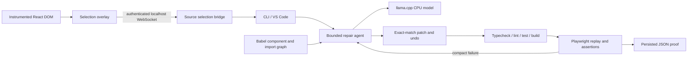

# Architecture

The npm workspace separates shared types, core logic, a Vite plugin, CLI and VS Code extension. The example is an ordinary React/Vite project. There is one agent and one inference process, with browser verification serialized after inference shutdown.

The plugin runs before JSX compilation and only for Vite serve. MagicString inserts source attributes into intrinsic JSX opening tags while retaining source maps. A shadow-root overlay highlights hovered nodes and intercepts a selection click. Metadata uses project-relative paths. The bridge binds 127.0.0.1, validates origin and a random session capability, and validates received source paths.

Babel parses JS/JSX/TS/TSX, extracts components, props, hooks, state, events, routes and ordinary relative imports. Names and resolved imports determine likely parent relationships. This is deliberately conservative: higher-order wrappers and dynamic imports need better analysis in later versions.

The provider uses llama.cpp's OpenAI-compatible local endpoint as a wire protocol only; it never calls OpenAI or another hosted provider. Qwen is a configurable default behind ModelProvider. Generation is constrained to JSON and a strict action schema. Repository text is untrusted data. Exact edits require a unique existing substring.

ResourceManager shuts down the model before launching verification. Vite is started only if the configured URL is unavailable; an existing user-owned server is retained. A single Chromium instance is created per replay and closed in finally. Process execution captures bounded output and has timeouts. Ctrl+C shuts down owned services.

Proof includes baseline failure, expected assertions, exact diff, static results and browser results. Skipped or failed browser verification cannot produce VERIFIED. The build must pass. No health score, cloud backend, vector database or parallel model workers exist.
